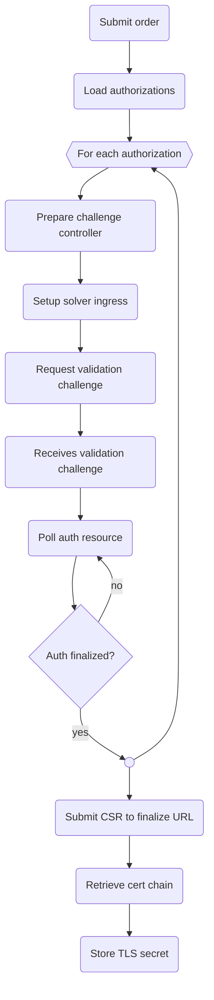

- [ACME Protocol Updates from Let's Encrypt](https://letsencrypt.org/docs/acme-protocol-updates/)
- [RFC 8555](https://datatracker.ietf.org/doc/html/rfc8555)
- [Access directory URLs](https://datatracker.ietf.org/doc/html/rfc8555#section-7.1.1)

## Implementation Notes

- [Kubernetes client with Fabric8](https://github.com/fabric8io/kubernetes-client)
- [JWS etc with Nimbus JOSE](https://connect2id.com/products/nimbus-jose-jwt)

## Issuing sequence

